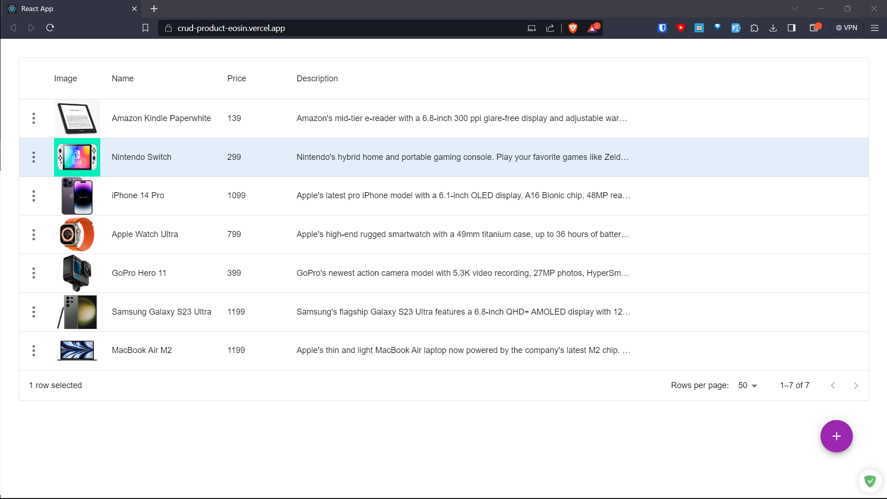
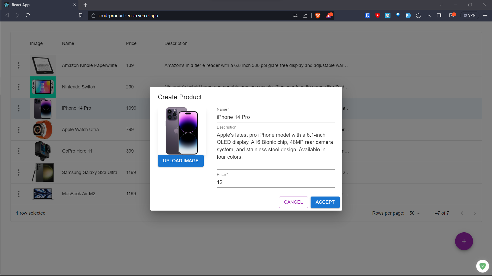

# Product CRUD

Simple CRUD application to explore serverless framework. The backend for this application is available at https://github.com/Bishalsarang/product-management-serverless-framework

# Screenshots



# Live DEMO
A live demo of the app is available at https://crud-product-eosin.vercel.app/. Please note that since the app is hosted in the free tier, you may experience a cold start.

# Tech Stack
- React
- TypeScript
- Material UI
- Formik
- Zod
- Axios

# Features
- ✅ Client Side Sorting and Filtering
- ✅ Form Validation using Formik and Zod
- ✅ Static Test using Eslint, Prettier & Husky
- ✅ Auto deployment to vercel

## Development

To get started with development, clone the repository and install dependencies:

```bash
git clone git@github.com:Bishalsarang/crud-product.git
```

```bash
npm install
```

To use the app, you will need to set the `REACT_APP_API_BASE_URL` environment variable to the base URL of the vaccine management REST API. This can be done in a `.env` file in the root of the project, like so:

`REACT_APP_API_BASE_URL='http://localhost:3000'`

Alternatively, you can set the environment variable in your environment or in the terminal before starting the development server:

```bash
export REACT_APP_API_BASE_URL='http://localhost:3000
``` 

Then, start the development server with:

```bash
npm start
``` 
This will start the development server at [http://localhost:3000](http://localhost:3000/). Any changes made to the code will automatically be reflected in the browser.

## Running Tests

To run tests, use the following command:

```bash
npm test
``` 

To run tests with coverage, use the following command:

```bash
npm test -- --coverage --watchAll=false
```
## Building and Deployment

To build the app for production, use the following command:

```bash
npm build
``` 
This will create a `build` directory .
